## Domino User Training Workshop: Predicting Wine Quality

#### In this workshop you will work through an end-to-end workflow broken into various labs to -

* Read in data from a live source
* Prepare your data in an IDE of your choice, with an option to leverage distributed computing clusters
* Train several models in various frameworks
* Compare model performance across different frameworks and select the best performing model
* Deploy model to a containerized endpoint and web-app frontend for consumption
* Leverage collaboration and documentation capabilities throughout to make all work reproducible and sharable!


# Section 1
## Set up a Domino Project

### Lab 1.1 - Forking Existing Projects
***Documentation: [Fork Projects](https://docs.dominodatalab.com/en/latest/user_guide/ef261b/fork-projects/)***

Once you have access to the Domino training environment, guide your mouse to the top **Search** menu. In the cell provided, begin typing *WineQualityProject*. 

You'll see any relevant projects, data sources, environments, etc., appear in the drop-down menu.

[make sure to remove or blur any employee names that show up in the screenshots]: #

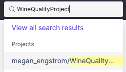

<!---

-->

1. Select the project called *WineQualityProject*.
2. Read the readme to learn more about the project's use case, status, etc.
3. In the top right corner, choose the icon to *fork* the project.
4. Name the project *Domino-Training-YourName*.

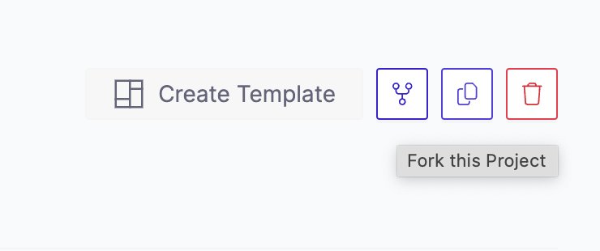
<!---

-->

**You've just created your first project!**

### Lab 1.2 - Update Project Settings
***Documentation: [Project Settings](https://docs.dominodatalab.com/en/latest/user_guide/dba65c/set-project-settings/)***

1. In your new project, click on **Settings** in the bottom left. This will take you to your project settings.
2. View the default hardware tier and compute environment - make sure they are set to *Small* and *WineQualityProject* respectively:

[I would consider omitting the bottom half of this graphic - it's really big! A neat thing to try would be to embed a small icon right after the word Settings in step 1]: #

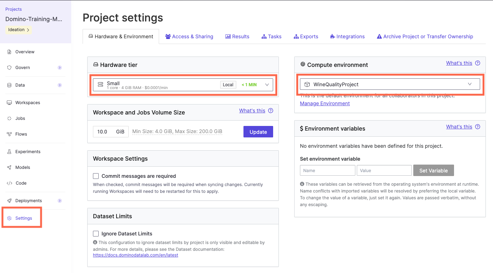
<!---

-->

3. Go to the **Access and Sharing** tab - change your project visibility to *Private*.
4. Add your instructor or another attendee as a collaborator in your project. 

[This screenshot is enormous! Try chopping it in half - the top half can go under step 3, bottom half under step 4. It also helps to put a bit of empty space between the previous step's screenshot and the next step's text]: #

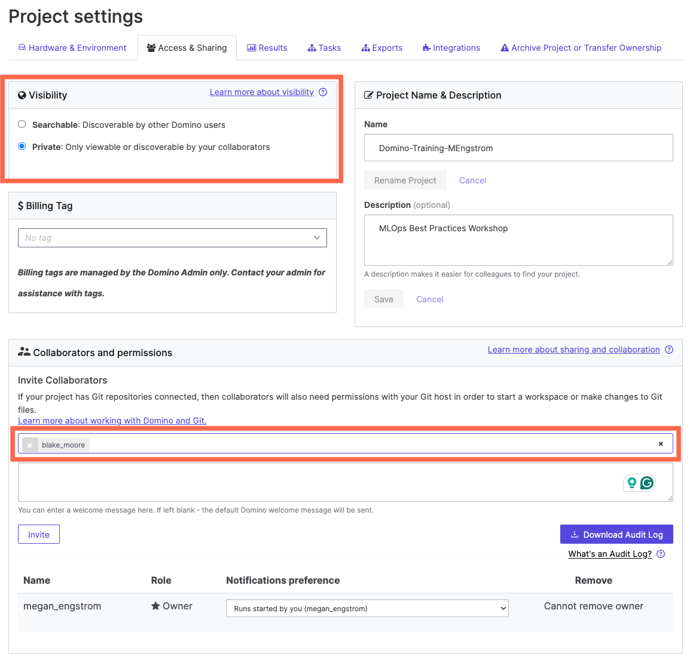
<!---

-->

**You've updated your project settings and added collaborators!**

### Lab 1.3 - Defining Project Tasks
***Documentation: [Add Project tasks](https://docs.dominodatalab.com/en/latest/user_guide/4e60ef/add-project-tasks/)***

[I reversed the order of these two options. Reason: newest way should be listed first! Older methods, last]: # 

1. In the left pane of your Project, navigate to *Govern* > *Tasks*. Depending on your version of Domino, you may also find this by navigating to *Overview* > *Tasks*.
2. In the top right of the Tasks window, click *Add Task*.
3. Enter *Explore Data* for the task name.
4. Update the stage to *Data Acquisition and Exploration*.
5. Assign yourself or one of your project collaborators as an owner of the task.
6. Click *Save*. 

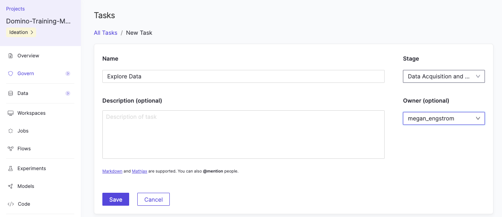
<!---

-->

**You've added a project task!**

# Section 2 
## Execute Code

### Lab 2.1 - Add a Data Source
***Documentation: [Add a Data Source to a Project](https://docs.dominodatalab.com/en/latest/user_guide/fa5f3a/use-data-sources/#add_an_existing_data_source_to_a_project)***

We will now add a data connection defined by the admin of our project to later query in data. 

1. Navigate to *Data > Data Sources* in the left pane of your project.
2. Click _Add a Data Source_.

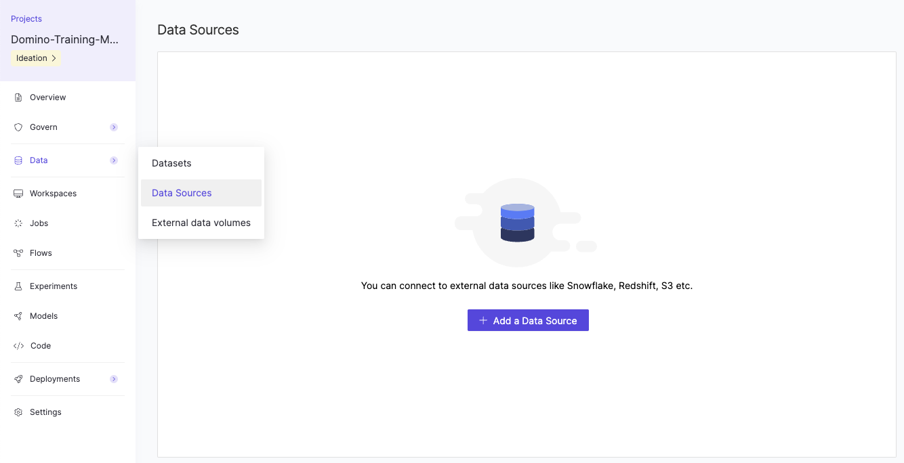
<!---

-->

3. Search for *WineQualityWorkshop*. You will see an Amazon S3 data store was created by your admin.
4. Select the data source and choose *Add to Project*.  

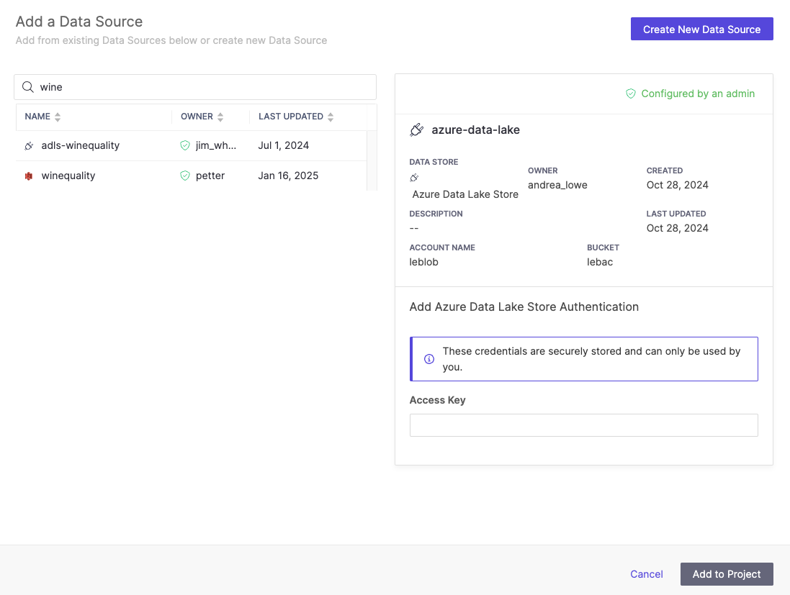
<!---

-->

[is there a way to format the "Yay! You did it!" stuff so that it stands out more? this gets a little lost between the screenshot and the next section]: #

**You've now added data to your Project!**

### Lab 2.2 - Launch a Workspace
***Documentation: [Launch a Workspace](https://docs.dominodatalab.com/en/latest/user_guide/e6e601/launch-a-workspace/)***

1. In your Project, click into the *Workspaces* tab on the left.
2. In the top right of the *Workspaces* page, click *Create New Workspace*.

[consider chopping the bottom half of this graphic off. Keep the relevant bits]: #

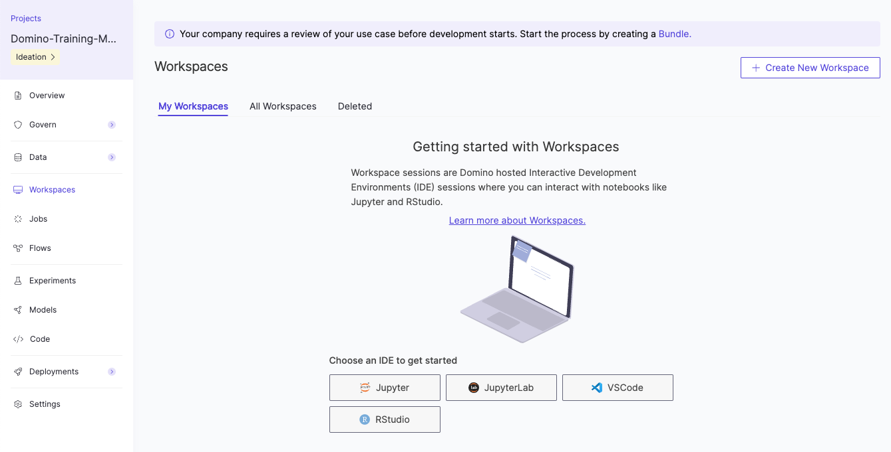
<!---

-->

A *Launch New Workspace* window appears. You'll see that the **Workspace Environment** already defaults to *WineQualityProject* because of the **Project Settings** you set in Lab 1.2. You always have the option to manually change the **Environment** for an individual workspace, which you can do here. Let's leave it as is for now.

3. Select *JupyterLab* as the *Workspace IDE*.

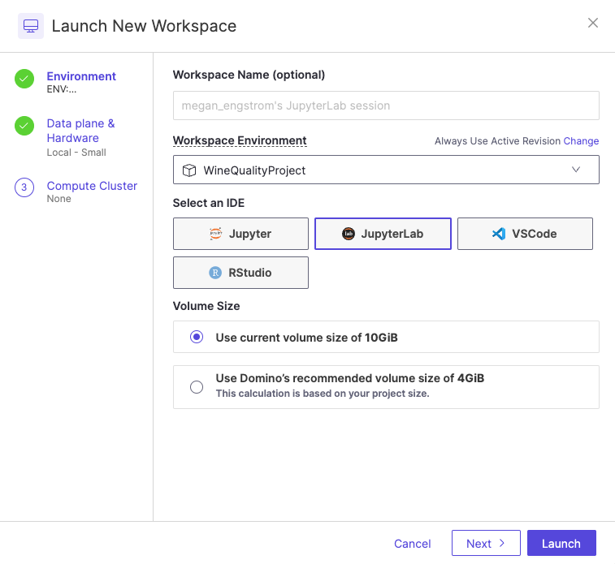
<!---

-->

4. Next, navigate to *Data Plane & Hardware*.
Again, you'll see Small is the default Hardware tier because of what we set in our Project Settings. We'll keep it as Small for this Workspace. 

5. Click *Launch* now.

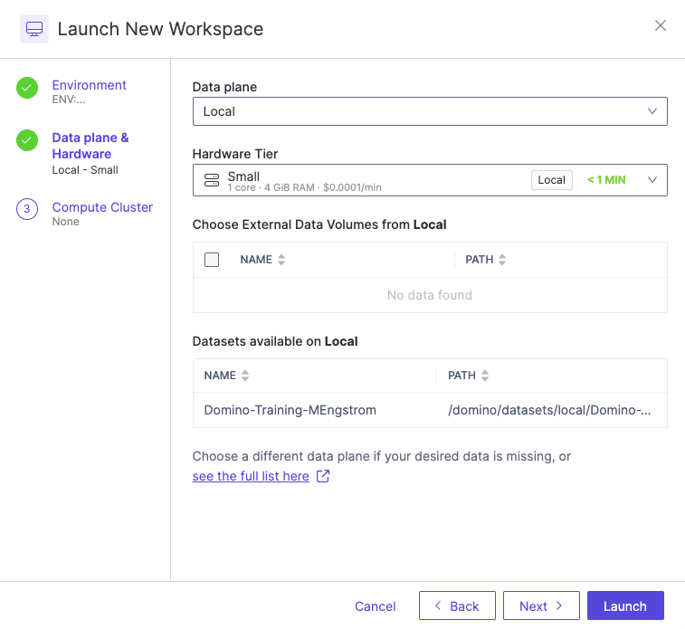
<!---

-->

**You've now launched your first Workspace!**

### Lab 2.3 - Execute Code

In your Workspace, create a new Python notebook by clicking the *Python* icon under *Notebook*.

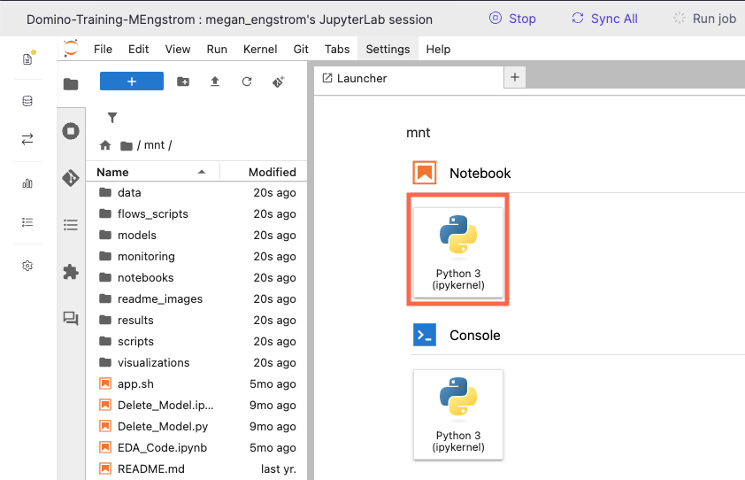
<!---

-->

In the left pane, click on the *Data* icon > *Data Sources* to find the Data Source added earlier. Copy the Python code snippet into the first line of your notebook and run the cell.

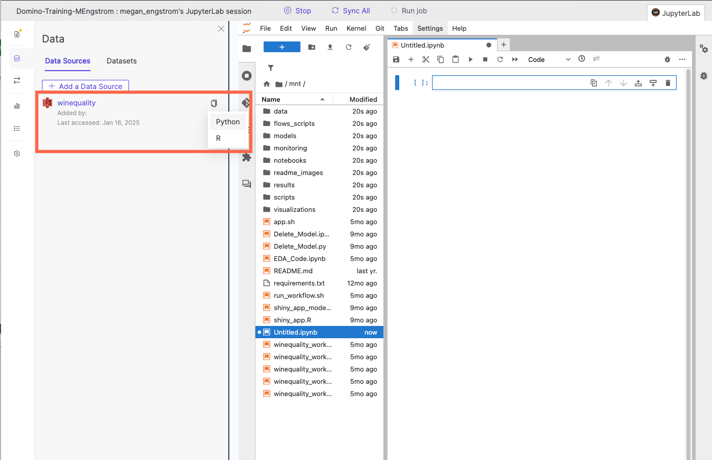
<!---

-->

After running the code snippet. Copy the code below into the following cell: 

```python
from io import StringIO
import pandas as pd

s=str(object_store.get("WineQualityData.csv"),'utf-8')
data = StringIO(s) 

df=pd.read_csv(data)
df.head()
```

Now, cell by cell, copy the code snippets below and run the cells to visualize and prepare the data! (You can click on the '+' icon to add a blank cell after the current cell):

```python
import seaborn as sns
import matplotlib.pyplot as plt
df['is_red'] = df.type.apply(lambda x : int(x=='red'))
fig = plt.figure(figsize=(10,10))
sns.heatmap(df.corr(numeric_only=True), annot = True, fmt='.1g')
```

```python
corr_values = df.corr(numeric_only=True).sort_values(by = 'quality')['quality'].drop('quality',axis=0)
important_feats=corr_values[abs(corr_values)>0.08]
print(important_feats)
sns.set_theme(style="darkgrid")
plt.figure(figsize=(16,5))
plt.title('Feature Importance for Wine Quality')
plt.ylabel('Pearson Correlation')
sns.barplot(x=important_feats.keys(), y=important_feats.values, palette='seismic_r')
```
```python
for i in list(important_feats.keys())+['quality']:
    plt.figure(figsize=(8,5))
    plt.title('Histogram of {}'.format(i))
    sns.histplot(df[i], kde=True)
```

Finally write your data to a Domino Dataset by running the following:

```python
import os
path = str('/domino/datasets/local/{}/WineQualityData.csv'.format(os.environ.get('DOMINO_PROJECT_NAME')))
df.to_csv(path, index = False)
```

Run all cells. Your notebook should be populated like the display below:

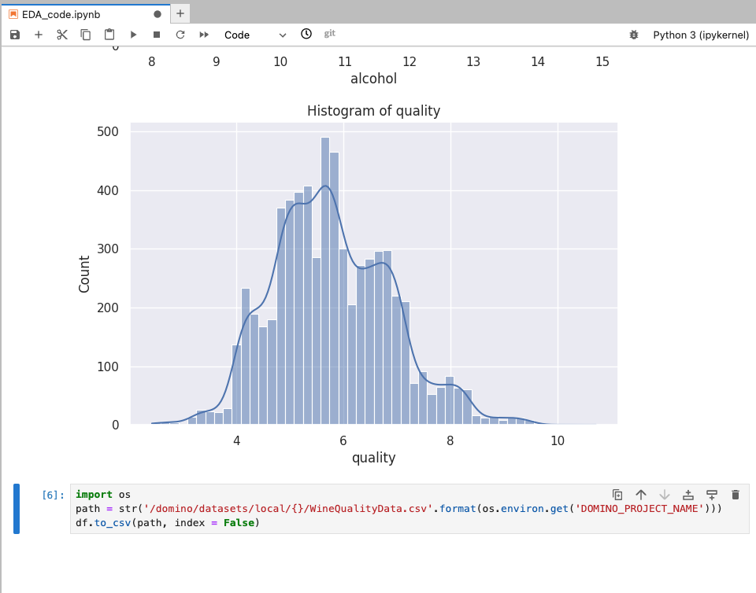
<!---

-->

Rename your notebook 'EDA_code.ipynb' by right-clicking on the file name as shown below. Click the Save icon.

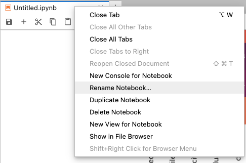
<!---

-->

**You've successfully executed some code!**

### Lab 2.4 - Syncing Files
***Documentation: [Sync changes in a Workspace](https://docs.dominodatalab.com/en/latest/user_guide/262fef/sync-changes-in-a-workspace/)***

Now that we've finished working on our notebook and written data back to our project, we want to sync our latest work. 

Click on the File Changes tab in the top left corner of your screen - 

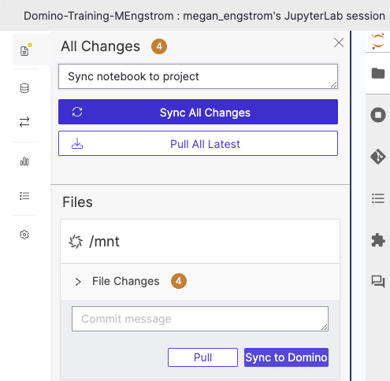
<!---

-->

Enter an informative but brief commit message such as "Sync EDA notebook to project" and click *Sync All Changes*. 

Click *Stop* at the top of your Workspace to stop the instance.

**You've now successfully synced changes!**

### Lab 2.5 - Complete Project Tasks
***Documentation: [Link files to Tasks](https://docs.dominodatalab.com/en/latest/user_guide/4e60ef/add-project-tasks/#tr3)***

Delete your stopped Workspace by clicking the trashcan icon in the Workspaces page.

In your Project, navigate to *Code*. You'll see that the latest commit will reflect the commit message you just logged, and you can see 'EDA_code.ipynb' in your file directory.

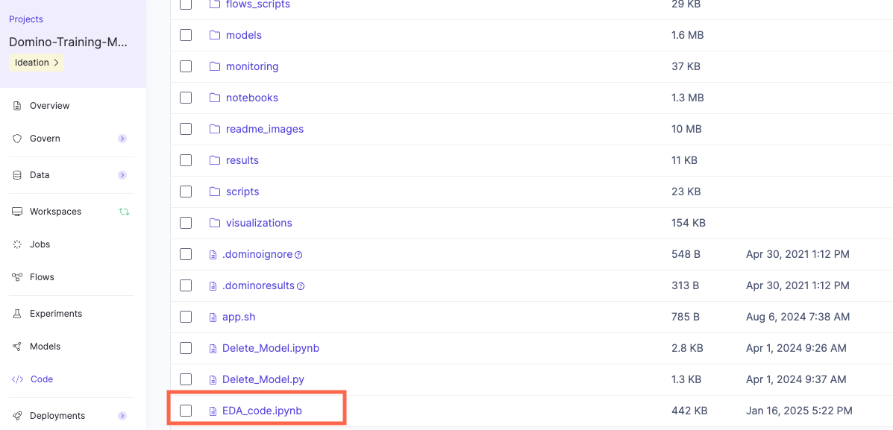
<!---

-->

Click on your notebook to view it. Click *Link to Task* in the top left and choose the *Explore Data* task we created in Lab 1.3.

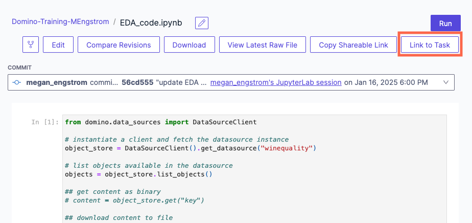
<!---

-->

Navigate back to the *Tasks* page, and select *Explore Data*. You'll see our linked notebook. Click on the circled checkmark to mark this complete. 

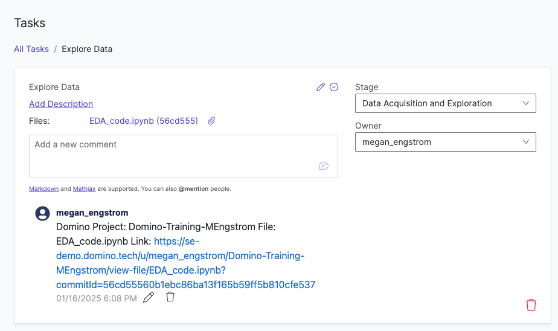
<!---

-->

**You've successfully completed a Project Task!**

### Lab 2.6 - Run Experiments with Domino Jobs
***Documentation: [Run a Job](https://docs.dominodatalab.com/en/latest/user_guide/af97b7/create-and-run-jobs/)***

Now it's time to train our models by using Domino Jobs! 

We are taking a three-pronged approach and building a model in sklearn (python), xgboost (R), and an auto-ml ensemble model (h2o).

If you'd like to see the details of what we'll run, navigate to *Code*. In your file browser go into the scripts folder and inspect *multitrain.py*. Check out the code in the script and comments describing the purpose of each line of code.

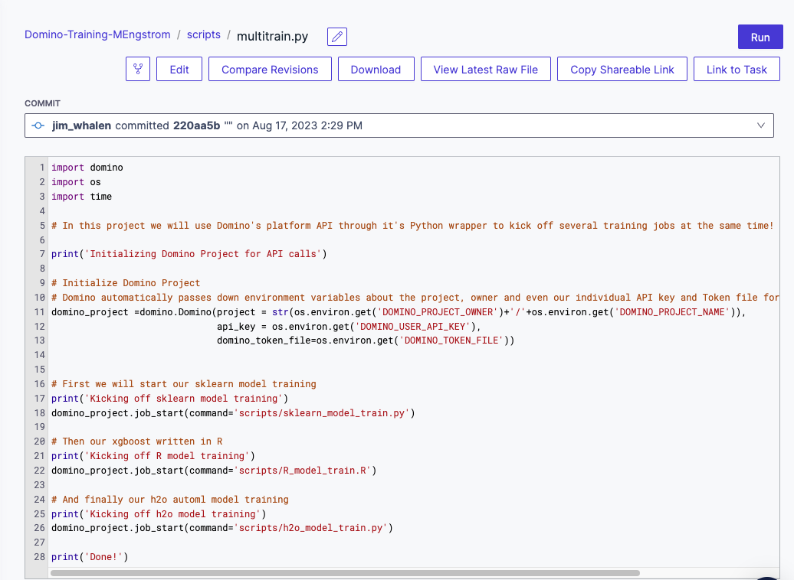
<!---

-->

You can also check out any of the training scripts that multitrain.py will call.

Navigate to *Jobs* in your Project and click *Run*.

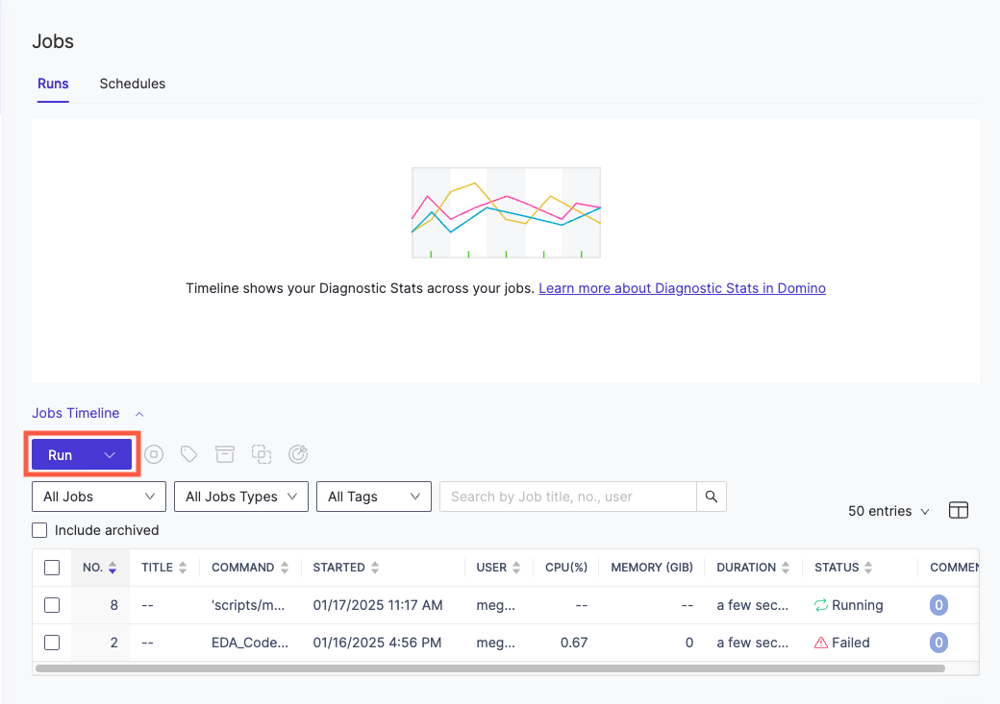
<!---

-->

Type or paste the following command below in the *File Name or Command* section of the *Start a Job* pop up window. Click on *Start* to run the job.

```shell
scripts/multitrain.py
```

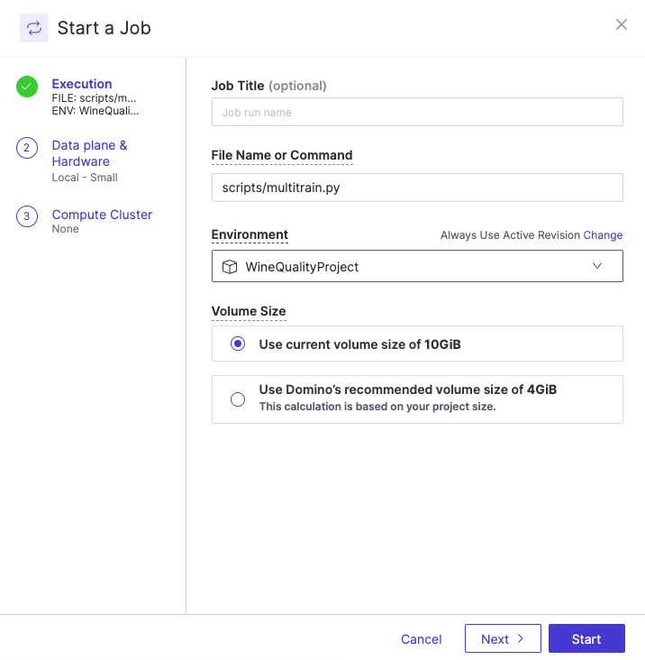
<!---

-->

Watch as three job runs have appeared, you may see them in starting, running, or completed state.

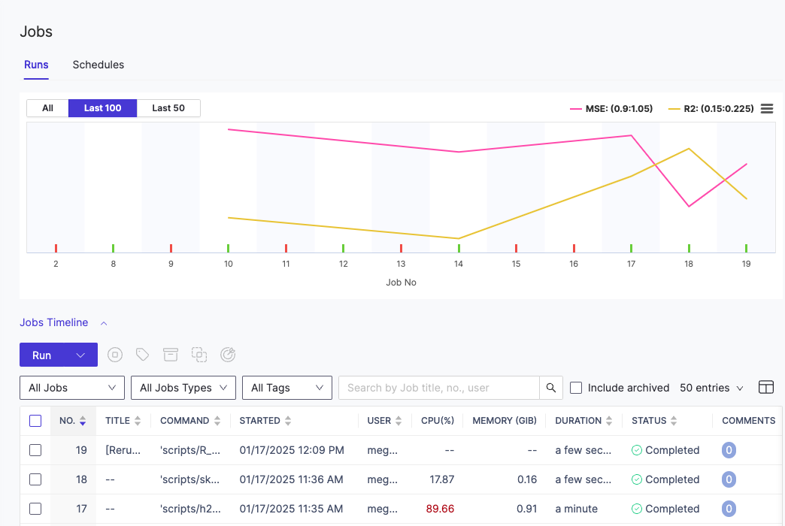
<!---

-->

Click into the sklearn_model_train.py job run.

In the *Details* tab of the Job run, you can see what versions of the code, software, and hardware were executed, along with details about who ran the Job and when. 

Click on the *Results* tab of the job. Scroll down to view the visualizations and other outputs of the job.

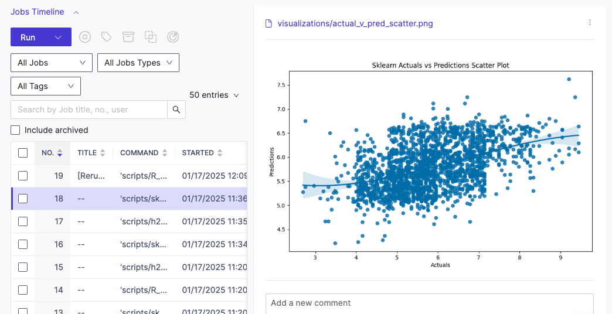
<!---

-->

**You've now trained three models!**

### Lab 2.7 - Track Experiments with MLflow
***Documentation: [Track and monitor experiments](https://docs.dominodatalab.com/en/latest/user_guide/da707d/track-and-monitor-experiments/)***

We've now trained 3 models and it is time to select which model we'd like to deploy. Domino experiment management leverages MLflow Tracking to enable easy logging of experiment parameters, metrics, and artifacts. MLflow runs as a service in your Domino cluster, fully integrated within your workspace and jobs, and honoring role-based access control. Existing MLflow experiments work right out of the box with no code changes required!

The jobs that we just ran had MLFlow tracking in them to log the R^2 value and Mean Squared Error (MSE).

To view the experiments click on the *Experiments* tab in your project. Here you have one set of experiments that all the jobs were logged against. Click on the experiment name to see more details.

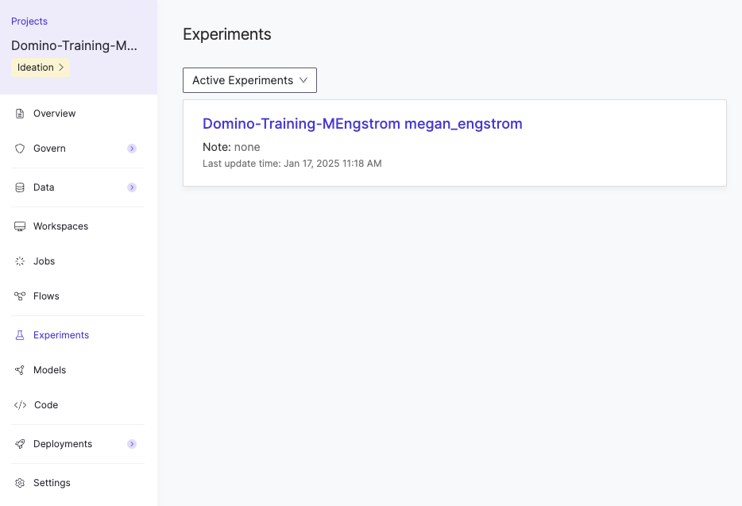
<!---

-->

Within the experiment we can see three different runs corresponding to the three different jobs we created. Our code tagged each with the framework that was used to create the model; H2o Automl, sklearn, and R in this case. We are also tracking the R^2 value and Mean Squared Error (MSE). Our visualisation currently shows only the R^2 value. Let's update it to show both R^2 and MSE so we can get a better view of our models.

Click on the three dots and choose *Edit*.

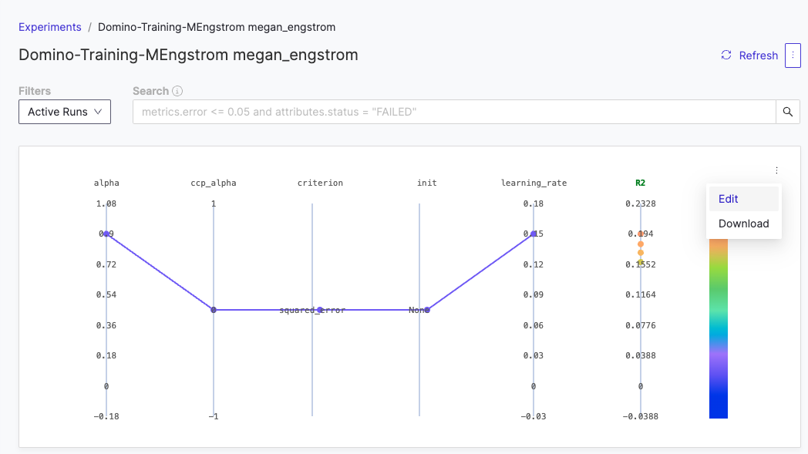
<!---

-->

Now click on *Target (Metrics)* and select *MSE* to add it to our visualisation. Then click *Save*.

From our results, it looks like the sklearn model is the best candidate to deploy, and our R model is failing. Let's compare the runs in more detail.

Click on the checkbox next to the runs you'd like to compare, then the _Compare_ button.

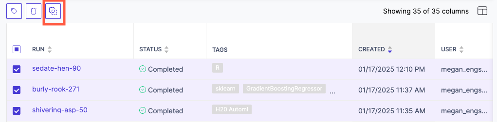
<!---

-->

Here we can see a lot more detail about the different runs. Scroll down to see the parameters (we aren't tracking any this time), the metrics, graphics that are created in the experiments and even the Domino execution details. This gives us the ability to track and share all of the experiments we are doing for a particular initative to ensure we get the best results and have documentation on how we got there.

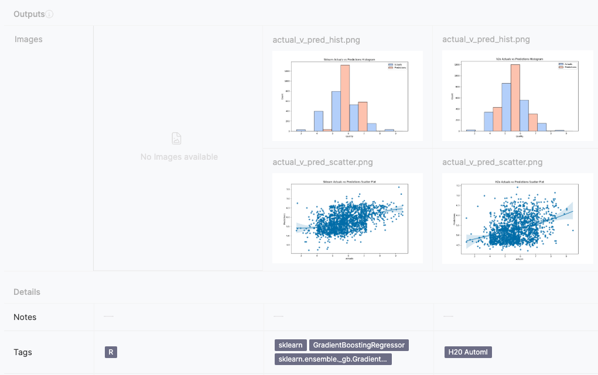
<!---

-->

**You've successfully compared experiments and selected a model in Domino!**

# Section 3 
## Deploy Models to Production

### Lab 3.1 Deploying Domino Endpoints
***Documentation: [Deploy Domino endpoints](https://docs.dominodatalab.com/en/latest/user_guide/8dbc91/deploy-domino-endpoints/)***

Now that you have completed model training and selection - it's time to get your model deployed.

In the last lab - we trained a sklearn model and saved it to a serialized (pickle) file. To deploy this trained model - we'll use a script to load in the saved model object and pass new records for scoring. 

To do so - navigate to *Deployments > Endpoints* in your project. Click *Create Domino endpoint*.

Name your model *wine-model-yourname*.
    
For the description add the following 
    
```
Model Endpoint to determine the quality of wine

Sample Scoring Request: 
    
{
  "data": {
    "density":0.99,
    "volatile_acidity": 0.028,
    "chlorides": 0.05 ,
    "is_red":0,
    "alcohol": 11
  }
}
```

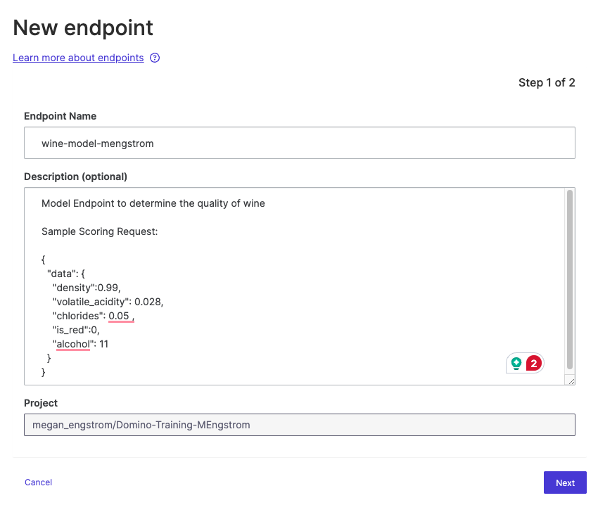
<!---

-->

Click *Next*. In the field *The file containing the code to invoke (must be a Python or R file)* enter the following:

```
scripts/predict.py
```
    
In the field *The function to invoke* enter the following:
    
```
predict
```

Confirm that the *Choose an Environment* has the *WineQualityProject* selected.

Check the box *Log HTTP requests and responses to model instance logs*.
    
Click *Create Endpoint*.
    
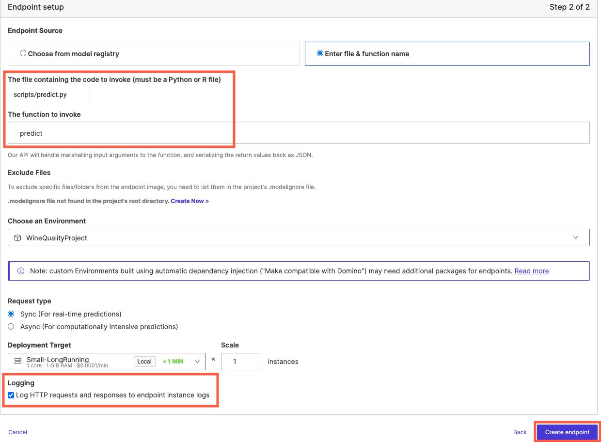
<!---

-->
  
Over the next 2-5 minutes, you'll see the status of your endpoint go from Preparing to Build -> Building -> Starting -> Running   

**You've now created a Domino Endpoint!**

### Lab 3.2 - Test your Endpoint
***Documentation: [Request Predictions](https://docs.dominodatalab.com/en/latest/user_guide/8dbc91/deploy-domino-endpoints/#Request-a-prediction)***
    
Once your endpoint reaches the Running state, a pod containing your object and code for inference is up and ready to accept REST API calls.

To test your endpoint, navigate to the Overview tab. In the request field in the Tester tab enter a scoring request in JSON form. You can copy the sample request that you defined in your description field.

``` 
{
  "data": {
    "density":0.99,
    "volatile_acidity": 0.028,
    "chlorides": 0.05 ,
    "is_red":0,
    "alcohol": 11
  }
}
```
    
In the response box you will see a *prediction* value representing your endpoint's predicted quality for a bottle of wine with the attributes defined in the Request box. Try changing 'is_red' from 0 to 1 and 'alcohol' from 11 to 5 to see how the predicted quality differs. Feel free to play around with different values in the Request box.

``` 
{
  "data": {
    "density":0.99,
    "volatile_acidity": 0.028,
    "chlorides": 0.05 ,
    "is_red":1,
    "alcohol": 5
  }
}
```

Note that there are several tabs next to the *Tester* tab that provide code snippets to score our endpoint from a web app, command line, or other external source.

In the next lab we will deploy an R shiny app that exposes a front end for collecting model input, passing that input to the model, then parsing the model's response to a dashboard for consumption.

**You've now tested the output of your Domino Endpoint!**

### Lab 3.3 Deploy a Web App
***Documentation: [Publish Apps](https://docs.dominodatalab.com/en/latest/user_guide/71635d/publish-apps/)***
    
Now that we have a pod running to serve new model requests - we will build out a front end to make calling our model easier for end-users.
    
In your Project, navigate to *Code*. If you have an ```app.sh``` file, open it now and verify it matches the below. If not, click on *New File* and paste the below code into the file. It's a bash script that will start and run the Shiny App server based on the inputs provided. Click *Save*.

```shell
#!/usr/bin/env bash
 
# This is a bash script for Domino's App publishing feature
# Learn more at http://support.dominodatalab.com/hc/en-us/articles/209150326
 
## R/Shiny Example
## This is an example of the code you would need in this bash script for a R/Shiny app
R -e 'shiny::runApp("./shiny_app.R", port=8888, host="0.0.0.0")'
 
## Flask example
## This is an example of the code you would need in this bash script for a Python/Flask app
#export LC_ALL=C.UTF-8
#export LANG=C.UTF-8
#export FLASK_APP=app-flask.py
#export FLASK_DEBUG=1
#python -m flask run --host=0.0.0.0 --port=8888
 
## Dash Example
## This is an example of the code you would need in this bash script for a Dash app
#python app-dash.py
```

Navigate back into the *Code* tab. Click add a new file and name it `shiny_app.R` (make sure the file name is exactly that, it is case sensitive) and then paste the following into the file:

```R
#
# This is a Shiny web application. You can run the application by clicking
# the 'Run App' button above.
#
# Find out more about building applications with Shiny here:
#
#    http://shiny.rstudio.com/
#
 
install.packages("png")
 
library(shiny)
library(png)
library(httr)
library(jsonlite)
library(plotly)
library(ggplot2)
 
 
# Define UI for application that draws a histogram
ui <- fluidPage(
  
  # Application title
  titlePanel("Wine Quality Prediction"),
  
  # Sidebar with a slider input for number of bins 
  sidebarLayout(
    sidebarPanel(
      numericInput(inputId="feat1",
                   label='density', 
                   value=0.99),
      numericInput(inputId="feat2",
                   label='volatile_acidity', 
                   value=0.25),
      numericInput(inputId="feat3",
                   label='chlorides', 
                   value=0.05),
      numericInput(inputId="feat4",
                   label='is_red', 
                   value=1),
      numericInput(inputId="feat5",
                   label='alcohol', 
                   value=10),
      actionButton("predict", "Predict")
    ),
    
    # Show a plot of the generated distribution
    mainPanel(
      tabsetPanel(id = "inTabset", type = "tabs",
                  
                  tabPanel(title="Prediction",value = "pnlPredict",
                           plotlyOutput("plot"),
                           verbatimTextOutput("summary"),
                           verbatimTextOutput("version"),
                           verbatimTextOutput("reponsetime"))
      )        
    )
  )
)
 
prediction <- function(inpFeat1,inpFeat2,inpFeat3,inpFeat4,inpFeat5) {
  
#### COPY FULL LINES 4-7 from R tab in Model APIS page over this line of code. (It's a simple copy and paste) ####
    
    body=toJSON(list(data=list(density = inpFeat1, 
                               volatile_acidity = inpFeat2,
                               chlorides = inpFeat3,
                               is_red = inpFeat4,
                               alcohol = inpFeat5)), auto_unbox = TRUE),
    content_type("application/json")
  )
  
  str(content(response))
  
  result <- content(response)
}
 
gauge <- function(pos,breaks=c(0,2.5,5,7.5, 10)) {
 
  get.poly <- function(a,b,r1=0.5,r2=1.0) {
    th.start <- pi*(1-a/10)
    th.end   <- pi*(1-b/10)
    th       <- seq(th.start,th.end,length=10)
    x        <- c(r1*cos(th),rev(r2*cos(th)))
    y        <- c(r1*sin(th),rev(r2*sin(th)))
    return(data.frame(x,y))
  }
  ggplot()+
    geom_polygon(data=get.poly(breaks[1],breaks[2]),aes(x,y),fill="red")+
    geom_polygon(data=get.poly(breaks[2],breaks[3]),aes(x,y),fill="gold")+
    geom_polygon(data=get.poly(breaks[3],breaks[4]),aes(x,y),fill="orange")+
    geom_polygon(data=get.poly(breaks[4],breaks[5]),aes(x,y),fill="forestgreen")+
    geom_polygon(data=get.poly(pos-0.2,pos+0.2,0.2),aes(x,y))+
    geom_text(data=as.data.frame(breaks), size=5, fontface="bold", vjust=0,
              aes(x=1.1*cos(pi*(1-breaks/10)),y=1.1*sin(pi*(1-breaks/10)),label=paste0(breaks)))+
    annotate("text",x=0,y=0,label=paste0(pos, " Points"),vjust=0,size=8,fontface="bold")+
    coord_fixed()+
    theme_bw()+
    theme(axis.text=element_blank(),
          axis.title=element_blank(),
          axis.ticks=element_blank(),
          panel.grid=element_blank(),
          panel.border=element_blank())
}
 
# Define server logic required to draw a histogram
server <- function(input, output,session) {
  
  observeEvent(input$predict, {
    updateTabsetPanel(session, "inTabset",
                      selected = paste0("pnlPredict", input$controller)
    )
    print(input)
    result <- prediction(input$feat1, input$feat2, input$feat3, input$feat4, input$feat5)
    print(result)
    
    pred <- result$result[[1]][[1]]
    modelVersion <- result$release$model_version_number
    responseTime <- result$model_time_in_ms
    output$summary <- renderText({paste0("Wine Quality estimate is ", round(pred,2))})
    output$version <- renderText({paste0("Model version used for scoring : ", modelVersion)})
    output$reponsetime <- renderText({paste0("Model response time : ", responseTime, " ms")})
    output$plot <- renderPlotly({
      gauge(round(pred,2))
    })
  })
  
}
 
# Run the application 
shinyApp(ui = ui, server = server)
```

**Go to line 63** note that this is missing input for your model api endpoint. In a new tab navigate to your model API you just deployed. Go into overview and select the R tab as shown below. Copy lines 4-7 from the R code snippet. Switch back to your new file tab and paste the new lines in line 64 in your file.

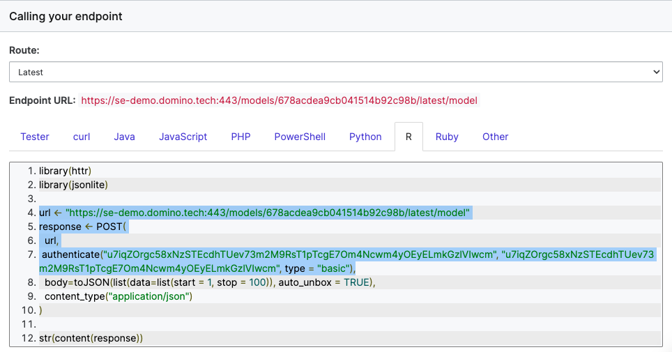
<!---

-->

Lines 61-79 in your file should look like the following (note the url and authenticate values will be different) 
                   
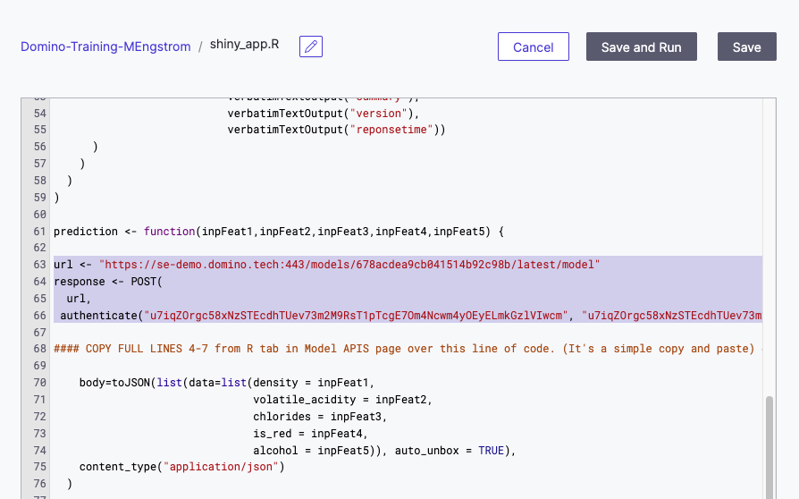
<!---

-->

Click *Save*.
                   
Now that you have your `app.sh` and `shiny_app.R` files created. Navigate to the *Deployments > App* tab in your project.

Enter a title for your app - *YourName Wine Quality Prediction*.

Click *Publish*.
                   
You'll now see the below screen, once your app is active (should be within ~1-3 minutes) you can click the View App button. 

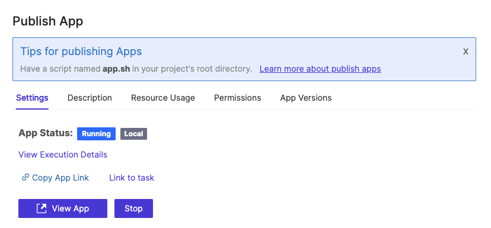
<!---

--> 

Once you're in the app you can try out sending different scoring requests to your model using the form on the right side of your page. Click *Predict* to send a scoring request and view the results in the visualization on the left side.
                   
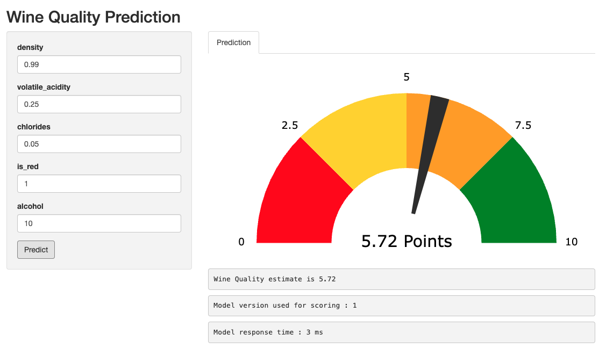
<!---

-->

**You've Now Created a Shiny App!**

### Lab 3.4 - Share Web App 
***Documentation: [App Security and Identity](https://docs.dominodatalab.com/en/latest/user_guide/cb9195/app-security-and-identity/)***

Congratulations! You have now gone through a full workflow to pull data from an S3 bucket, clean and visualize the data, train several models across different frameworks, deploy the best performing model, and use a web app front end for easy scoring of your model. Now the final step is to get your model and front end into the hands of the end users.

In your App, navigate to the *Permissions* tab.   

In the Permissions tab, update the permissions to allow *Anyone, including anonymous users*.

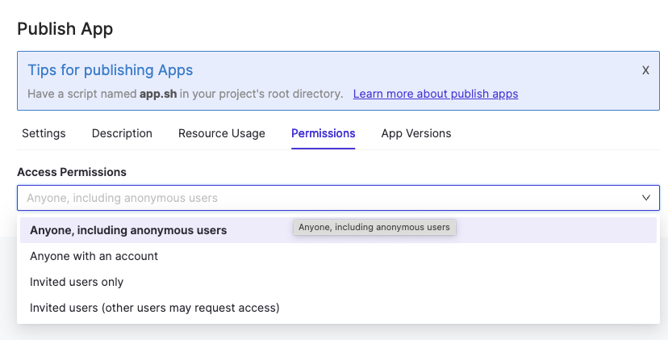
<!---

-->

Navigate back to the *Settings* tab and click *Copy App Link*

Paste the copied link into a new private/incognito window. Note that you're able to view the app without being logged into Domino.

PS - Domino provides free licenses for business users to log in and view apps.

***Congratulations! You have now gone through a full workflow to pull data from an S3 bucket, clean and visualize the data, train several models across different frameworks, deploy the best performing model, and use and share a web app front end for easy scoring of your model!***

### *** End of Labs *** 


